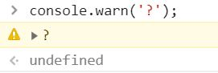
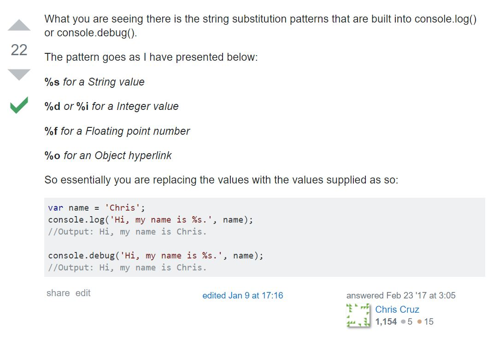
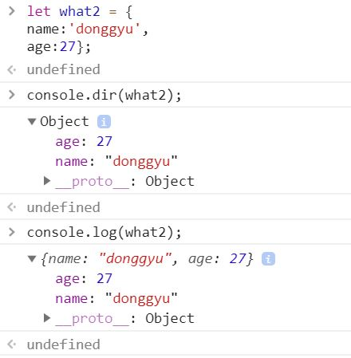

# 6장 웹 브라우저에서의 입출력

**일반적인 프로그램과 달리 ECMAScript에는 입출력에 관한 규정이 없습니다.**
**입출력을 각각의 자바스크립트 실행환경, 예를 들면 브라우저 등이 독자적으로 구현하고 있으므로 사용하는 자바스크립트 실행 환경에 따라 입력방법과 출력 방법이 달라집니다. 이 장에서는 웹브라우저에서 입력하는 방법과 출력하는 방법에 대해 배웁니다!**

### 6.1 대화상자 표시하기
- 대화상자
 -  window.alert
 -  window.prompt
    -   prompt가 반환하는 값은 string(문자열)이라서, number로 바꿔서 사용하고 싶다면 parseInt나 parseFloat를 활용해야 합니다
 -  window.confirm
    - boolean을 반환합니다
### 6.2 console
- console객체의 메소드
  - console.log
  - console.dir  
    : 객체의 대화형 목록을 출력합니다.  
  -  console.error  
    : 오류 메시지 출력
  -  console.info  
    : 메시지 타입 로그를 출력   
  -  console.warn  
    : 경고메시지 출력  
    

    - console.time, console.timeEnd<br>:처리시간 측정용 타이머를 시작, 정지 및 경과시간 출력
    - console.trace : 스택 트레이스를 출력

- 콘솔에 텍스트 출력하기
  - C언어 스타일로 서식 문자열(format specifier)을 사용하여 출력할수도 있다<br>
    ```js
    var name = "TOM"
    var height 172.5;
    console.log("그의 이름은 %s 이며 키는 %f 센티미터 입니다", name, height);
    ```
    <br><br> ** %d 에서 'd'는 'decimal'을 의미합니다.

- 객체의 프로퍼티를 목록으로 표시하기<br>
console.dir 메소드는 객체의 프로퍼티를 나열합니다.<br>
    <log와 dir의 차이>  
    

    log는 바로 해당하는 객체의 내용을 보여주고 dir은 트리형식으로 보여준다.
    <hr>

- **타이머**<br>
console.time과 console.timeEnd 메서드를 사용해서 특정 코드의 실행 시간을 측정할 수 있습니다.

```js
console.time('timer_for_alert');
alert('실행코드의 작동시간을 측정해봅시다');
console.timeEnd('timer_for_alert');//타이머 이름이 같아야 정상적으로 작동합니다

//timer_for_alert: 1214.102783203125ms
```


### 6.3 이벤트 처리기 등록하기와 타이머 알아보기
웹 브라우저에서 동작하는 프로그램은 기본적으로 **'Event driven program'** 입니다.
이벤트란 사용자가 버튼을 클릭하는 행위처럼, 단말기와 애플리케이션이 처리할 수 있는 동작이나 사건을 뜻합니다.

**이벤트 주도형 프로그램**이란 이벤트가 발생할 때까지 기다렸다가 이벤트가 발생했을 때 미리 등록해 둔 작업을 수행하는 프로그램을 말합니다.

이벤트 처리기(Event Handler)란 이벤트가 발생했을 때 실행되는 함수를 말합니다. 함수를 이벤트가 발생했을 때 동작할 이벤트 처리기로 설정하는 행위를 가리켜 '함수를 이벤트의 이벤트 처리기로 등록'(add function as event handler of the specific event)한다고 합니다.

**함수를 이벤트 처리기로 등록하는 방법에는 세가지가 있습니다!**


## 1. HTML element 의 attribute(속성)로 등록하는 방법 (onClick)
```html
<!DOCTYPE html>
<html>
<head>
    <meta charset="UTF-8">
    <title>현재시간을 콘솔에 표시하기</title>
    <script>
        function displayTime(){
            let d = new Date();
            document.write(`현재시간은 ${d.toLocaleString()} 입니다!`);//Date객체의 'toLocalString()' 메소드는 지역화된 시간과 날짜정보를 제공합니다. 다른 메소드를 보고싶다면 책 119p참고^^
        }
    </script>
</head>
<body>
    <input type="button" value="click" onclick="displayTime()">
</body>
</html>
```

여기에서 onClick부분을 '이벤트 처리기 이름' 이라고 하며, 이벤트 처리기 이름은 곧 이벤트 유형을 뜻합니다. 주요 이벤트에 대한 이벤트 처리기의 이름은 아래와 같습니다!

잘 모르는 부분은 https://www.w3schools.com/tags/ref_eventattributes.asp에 가시면 간단한 예제로 잘 설명되어 있습니다. 여기서 보는 것보다 훨씬 이해가 빠릅니다.
- onclick : 클릭
- ondblclick : 더블클릭
- 
- onmousedown : 마우스 버튼 눌렀을 때
- onmouseup : 버튼에서 손 뗐을 때
- onmousemove : 해당 html요소 위에서 '움직일 때'
- onmouseout : html요소 안에서 나갔을 때
- onmouseover : '해당 html 요소 위로 '올라왔을 때'
- 
- onkeydown : 키 눌렀을 때
- onkeypress : 키를 누르고 손가락을 떼었을 때
- onkeyup : 키보드의 키에서 손가락을 떼었을 때
- 
- **key down과 key press의 차이!<br>: 두 차이는 'character'와 'key'의 차이이다. 먼저 순서로 보자면 down이 먼저, press가 그 다음, up이 마지막인데 'key'라는 것은 physical button을 의미하고 'character'는 그 버튼을 눌렀을 때 입력되는 어떤 symbol을 의미한다. 아래 링크에서 tester에 무언가를 길게 입력해보면 key down과 key press의 차이를 명확하게 알 수 있을 것이다!!
  http://web.archive.org/web/20161212021242/http://www.bloggingdeveloper.com/post/KeyPress-KeyDown-KeyUp-The-Difference-Between-Javascript-Key-Events.aspx
- 
- onchange : input 요소의 값이 바뀌었을 때
- onblur : input요소가 포커스를 잃었을 때
- onfocus : input 요소에 포커스를 맞추었을 때 (예제링크 : https://www.w3schools.com/jsref/tryit.asp?filename=tryjsref_onfocus)
- onselect : 텍스트필드등의 텍스트를 선택했을 때(https://www.w3schools.com/tags/tryit.asp?filename=tryhtml5_ev_onselect)
- onsubmit : 폼 제출 버튼을 눌렀을 때
- onload : HTML을 모두 읽어들였을 때
- onunloadWeb : 웹 페이지가 메모리에서 내려갈 때(예 : 다른 페이지로 전환할 때)
- onabort : 페이지나 이미지 읽어들이기가 '**중단**'되었을 때(에러핸들링)
- onerror : 페이지나 이미지를 읽어 들이는 동안 '**오류가 발생**'했을 때(에러핸들링)
- onresize : HTML요소의 크기가 바뀌었을 때

각 HTML element attribute을 사용해서 이벤트 처리기를 등록하면 HTML코드와 자바스크립트 코드가 뒤섞인다는 단점이 있습니다. HTML 코드와 자바스크립트 코드를 분리하려면, 다음 절에서 설명하는 DOM에서 가져온 HTML element에 이벤트 처리기 지정하기 를 사용하거나 addEventListener메서드를 사용합니다.

<hr>

## 2. DOM element 의 property로 등록하는 방법(객체의 프로퍼티에 등록)

DOM을 사용해서 EventHandler 등록하기

1) window.onload를 사용하여 HTML문서를 다 읽어들인 후에 2) 와 3) 을 실행하도록 한다.
2) document.getElementById 메서드를 사용하여 특정 id 속성값을 가진 HTML element를 가져온다
3) 해당 element의 eventHandler property에 원하는 함수를 등록한다.

```html
<!DOCTYPE html>
<html>
<head>
    <meta charset="UTF-8">
    <title>시간을 콘솔에 표시해보자</title>
    <script>
        function displayTime(){
            var d = new Date();
            console.log(`현재시각은 ${d.toLocaleString()}입니다.`);
        }

        //1. Window객체의 onload프로퍼티에 함수를 저장한다. 따라서 해당 함수는 웹 브라우저가 문서를 모두 읽어들인 후에 실행된다.
        window.onload = function(){
            var button = document.getElementById("button");//button엘리먼트를 자바스크립트 객체로 가져오고
            button.onclick = displayTime;//해당 객체의 프로퍼티로 우리가 만든 이벤트핸들러(displayTime)을 넣어준다
        }
        //이렇게 DOM에 이벤트핸들러를 등록하는 가장 큰 목적은 html과 js코드가 분리된다는 것!
        //코드를 분리하면 프로그램의 가독성과 유지 보수성이 높아진다.
    </script>
</head>
<body>
    <input type="button" value="click it!" id="button">
</body>
</html>
```

코드를 분리하면 프로그램의 가독성과 유지보수성이 높아집니다. 이를 구현하기 위해 script요소를 head요소의 자식요소로 배치합니다. DOM을 사용하면 body요소의 바깥에서 body요소 안에 있는 HTML element를 조작할 수 있습니다. 그러나 head요소안에있는 script코드가 실행되는 시점은 body를 아직 읽어들이지 못한 시점입니다. 따라서 이 시점에는 조작하고자 하는 element가 없으므로 이벤트 처리기를 등록할 수 없습니다. 그래서 이벤트 처리기를 등록하는 작업의 실행 시점을 HTML 문서 전체를 읽어 들인 이후로 미룹니다.!! 그래서 window.onload를 쓰는거구나

```window.onload = function(){...};```

이 코드 덕분에 head 안의 script에서도 body의 element를 조정하는 코드를 수행할 수 있습니다. 이렇게 하지 않으려면 body 맨 아래쪽에 script를 써넣으면 되겠죵

3. addEventListener 메서드를 사용하는 방법 -> 이 방법은 책 576쪽에 있으므로 6장 범위를 벗어나지만 간략하게 정리해보도록 하겠습니다

<hr>

## 타이머  
웹브라우저의 Window객체에는 setTimeout과 setInterval 메서드가 있습니다. 이들 메서드를 활용하면 지정된 시간이 흐른 후에 함수를 실행하거나 일정한 시간 가격에 따라 함수를 반복 실행할 수 있습니다.

- 지정된 시간이 흐른 후에 함수 실행하기 : setTimeout(callback(), millisecond)
- *** 지연시간을 0 밀리초로 지정하면 어떨까요? 지정된 함수가 바로 실행되지 않고, 현재 실행 중인 이벤트 처리기의 작업이 끝나기를 기다렸다가 가능한 빨리 실행됩니다. 이것은 자바스크립트가 싱글스택콜엔진? 을 기반으로 작동하는 언어이기 때문인데, 이에 관한 유튜브 영상 url 첨부합니다.
https://www.youtube.com/watch?v=iNH4UQxZexs&t=47s

- 지정된 시간마다 반복해서 실행하기 : setInterval(callback, millisecond)


### 6.4 HTML 요소를 동적으로 읽고 쓰기
자바스크립트를 사용해서 HTML element안의 내용을 동적으로 읽고 씁니다.

1. HTML요소의 innerHTML 프로퍼티로 읽고 쓰기
```html
<!DOCTYPE html>
<html lang="ko">
<head>
    <meta charset="UTF-8">
    <script>
        window.onload = function(){
            var startButton = document.getElementById('start');
            var stopButton = document.getElementById('stop');
            var display = document.getElementById('display');
            var startTime, timer;
            startButton.onclick = start; //start버튼 활성화. 객체의 프로퍼티에다가 이벤트핸들러를 먹임

            //이벤트핸들러 start정의
            function start(){
                startButton.onclick = null;//start를 눌러서 해당 이벤트를 실행했으니 start버튼 비활성화
                stopButton.onclick = stop;//stop버튼 활성화
                startTime = new Date();//0.01초마다 경과한 시간을 표시
                
                timer = setInterval(function(){//timer 시작!, setInterval의 콜백함수 정의
                    var now = new Date();//display에 경과한 시간 쓰기
                    display.innerHTML = ((now-startTime)/1000).toFixed(2);}//그냥 빼기만하면 초단위가 아니라 milliseconds단위로 나오기 때문에 1000으로 나누어주어야 하고, toFixed(2)로 소숫점 둘쨋자리까지만 나올 수 있도록 해준다.
                    ,10)
            }

            //이벤트핸들러 stop 정의
            function stop(){
                clearInterval(timer);//setInterval 해제
                startButton.onclick = start; //start버튼 활성화
            }
        };
    </script>
</head>
<body>
    <p id="display">0.00</p>
    <input id="start" type="button" value="start">
    <input id="stop" type="button" value="stop">
</body>
</html>

```
2. 폼 컨트롤의 입력 값 읽기
input element 등의 폼 컨트롤 요소(form control element)를 사용하면 사용자의 입력값을 자바스크립트 프로그램에서 사용할 수 있다.

각 form control element의 관련 property는 다음과 같다.
- input -> value, checked : 입력된 값을 문자열로 변환한 것, 논리값
- select -> selectedIndex : boolean(=logical value. true of false)
- textarea -> value : 입력된 문자열

이하는 input element를 활용하여 입력값을 구하는 예제로, 키와 몸무게를 입력받아 체질량 지수를 계산하여 표시하는 프로그램. 참고로 체질량지수는 몸무게를 키의 제곱으로 나눈 값이다.
```html
<!DOCTYPE html>
<html>
<head>
    <meta charset="utf-8" />
    <script>
        window.onload = function(){
            document.getElementById("button").onclick = function(){
                //input element에 입력된 몸무게 데이터와 키 데이터를 가져온다
                var h = parseFloat(document.getElementById("height").value);
                var w = parseFloat(document.getElementById("weight").value);
                //체질량지수를 나타내는 bmi라는 id를 가진 element(output element)에 기록
                var bmi = document.getElementById("bmi");
                bmi.innerHTML = (w/h/h).toFixed(1);
            };
        };
    </script>
</head>
<body>
    <p>키: <input type="number" id="height"> m</p>
    <p>몸무게: <input type="number" id="weight"> kg</p>
    <p>당신의 체질량지수는 <output id="bmi">?</output> 입니다!</p>
        <input type="button" id="button" value="계산">
</body>
</html>

```

3. document.write

자바스크립트를 이용한 프로그래밍에서, output은 통상적으로 위에서처럼 innerHTML등으로 html element내에 출력하는 것이 일반적이지만 초창기에는 document.write만이 유일한 수단이었다.

document.write메서드는 인수로 받은 문자열을 HTML 문서의 body element안에 출력한다.

```html
<body>
    <script>
        var now = new Date();
        var month = now.getMonth() + 1;
        var day = now.getDate();

        document.write("<p>오늘은" + month + "월" + day + "일 입니다. </p>");
    </script>
</body>
```
다만 document.write를 사용하면 script가 읽히는 시점에서 문서 전체 내용(HTML문서)을 해당 내용으로 바꾸어버리기 때문에, document.write가 호출 된 이후에 호출된 함수에서는 HTML문서를 동적으로 수정할 수 없게 된다. 따라서 동적으로 HTML문서를 변경하려면 DOM을 사용해야 한다. 

### 6.5 Canvas를 활용한 컴퓨터 그래픽스

Canvas는 웹 브라우저에서 그래픽을 처리하기 위해 추가된 HTML5 구성요소이다.
원래는 애플이 macOS와 사파리에서 UI를 만들기 위해 위젯이나 이미지를 렌더링할 목적으로 개발한 것인데, 지금은 크롬 등의 주요 브라우저에서 사용 가능하다. 익스플로러에서는 IE9부터 사용가능.

Canvas로는 2차원 그래픽과 WebGL을 사용한 3차원 그래픽을 구현할 수 있다.


1. Canvas의 특징

Canvas는 즉시 실행형 low level API이다.

저수준(low-level) : Canvas는 선, 원, 사격형을 그리는 등의 기본적인w 그리기 기능만 제공하므로 그리는 속도가 빠르다. 즉 저수준 API란 기본적인 기능만 제공하는 API라는 뜻이다. 따라서 더욱 복잡한 그림은 저수준API를 활용한 애플리케이션으로 그린다. ㅇㅋㅇㅋ

즉시 실행형 : Canvas의 그리기 명령은 호출하는 즉시 실행된다. 그림 상태를 저장하는 중간 데이터 계층이 없다.


2. Canvas의 기본적인 사용법

Canvas를 활용해 사각형을 그려봅시다.
```html5

```

